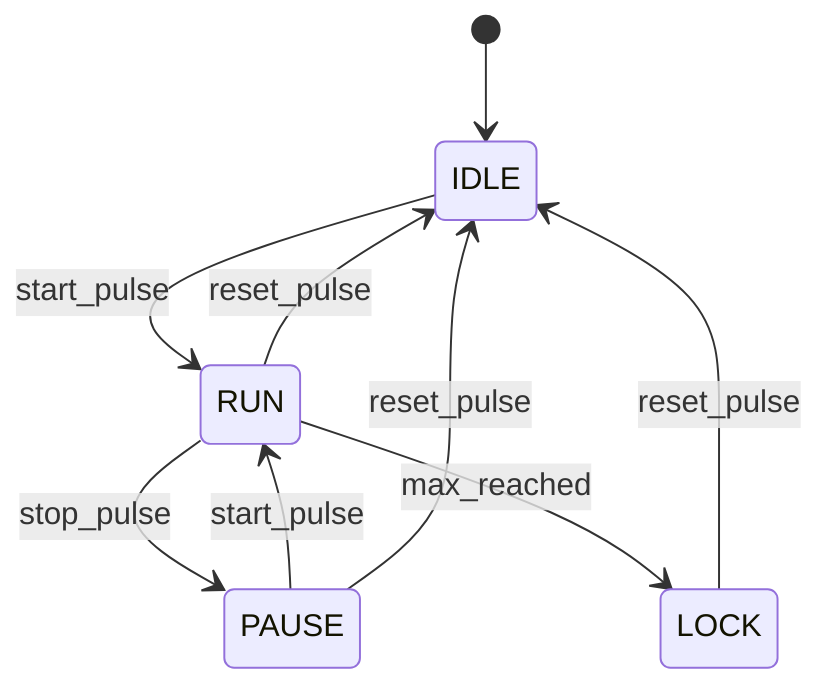

<p align="center">
  
  
  
  
</p>

<h1 align="center">⏱️ FPGA Digital Stopwatch</h1>

<p align="center">
  <strong>A precision RTL stopwatch design featuring FSM control, modular architecture, and 10ms resolution</strong>
</p>

<p align="center">
  <em>Portfolio project demonstrating proficiency in Verilog HDL and Digital Logic Design</em>
</p>

---

## 📋 Table of Contents

- [Overview](#-overview)
- [Features](#-features)
- [Architecture](#-architecture)
- [Project Structure](#-project-structure)
- [Getting Started](#-getting-started)
- [Simulation](#-simulation)
- [Design Parameters](#-design-parameters)
- [State Machine](#-state-machine)
- [Testing](#-testing)
- [License](#-license)

---

## 🎯 Overview

This repository contains the complete RTL implementation of a **Digital Stopwatch** designed for FPGA deployment. The design targets a standard 50MHz clock source and provides **centisecond (10ms) resolution** timing up to **59:59:99** (minutes:seconds:centiseconds).

The architecture emphasizes:
- **Clean, synthesizable Verilog code**
- **Modular, hierarchical design patterns**
- **Robust control logic with FSM**
- **Hardware-ready signal conditioning**

---

## ✨ Features

| Feature | Description |
|---------|-------------|
| 🕐 **10ms Resolution** | Precise centisecond timing with cascaded counter chain |
| 🔄 **4-State FSM** | Robust control: Idle → Run → Pause → Lock |
| 🔘 **Button Debouncing** | Hardware-grade signal conditioning for mechanical buttons |
| ⏸️ **Pause/Resume** | Full stop and continue functionality |
| 🔒 **Auto-Lock** | System locks when max time (59:59:99) is reached |
| ⚡ **Parameterized** | Easy adaptation for simulation vs. synthesis |

---

## 🏗️ Architecture

The design follows a **separation of concerns** principle with three main subsystems:

```
┌─────────────────────────────────────────────────────────────────┐
│                        TOP MODULE                                │
├─────────────────────────────────────────────────────────────────┤
│                                                                  │
│   ┌──────────────┐     ┌──────────────┐     ┌──────────────┐   │
│   │   DEBOUNCE   │────▶│     FSM      │────▶│  STOPWATCH   │   │
│   │   (Input)    │     │ (Controller) │     │  (Datapath)  │   │
│   └──────────────┘     └──────────────┘     └──────────────┘   │
│         ▲                     ▲                    │            │
│         │                     │                    │            │
│    Raw Buttons           max_reached          Time Output       │
│                                                                  │
└─────────────────────────────────────────────────────────────────┘
```

### Subsystem Details

| Subsystem | Module | Responsibility |
|-----------|--------|----------------|
| **Input Processing** | `debounce.v` | Synchronization, noise filtering, edge detection |
| **Control Plane** | `FSM.v` | State management, enable/reset signal generation |
| **Datapath** | `stopwatch.v` | Clock division, cascaded counting, overflow detection |

---

## 📁 Project Structure

```
📦 self_learning_verilog
├── 📂 src/                    # RTL Source Files
│   ├── top.v                  # Top-level module
│   ├── FSM.v                  # Finite State Machine controller
│   ├── stopwatch.v            # Counter chain (datapath)
│   ├── counter.v              # Generic counter module
│   └── debounce.v             # Button debouncer
│
├── 📂 tb/                     # Testbenches
│   ├── top_tb.v               # System-level integration test
│   ├── FSM_tb.v               # FSM unit test
│   ├── stopwatch_tb.v         # Datapath test
│   ├── counter_tb.v           # Counter unit test
│   └── debounce_tb.v          # Debounce logic test
│
├── 📂 sim/                    # Simulation outputs
│   └── *.vcd                  # Waveform dumps
│
└── 📂 gtk/                    # GTKWave configurations
```

---

## 🚀 Getting Started

### Prerequisites

- [Icarus Verilog](http://iverilog.icarus.com/) - Verilog compiler/simulator
- [GTKWave](http://gtkwave.sourceforge.net/) - Waveform viewer (optional)

### Installation

```bash
# Clone the repository
git clone https://github.com/yourusername/self_learning_verilog.git
cd self_learning_verilog
```

---

## 🔬 Simulation

### Quick Start

```bash
# Compile and run the top-level testbench
iverilog -o sim/top_sim tb/top_tb.v src/*.v
vvp sim/top_sim

# View waveforms (optional)
gtkwave sim/top.vcd
```

### Running Individual Tests

```bash
# FSM Controller Test
iverilog -o sim/FSM_sim tb/FSM_tb.v src/FSM.v
vvp sim/FSM_sim

# Debounce Logic Test
iverilog -o sim/debounce_sim tb/debounce_tb.v src/debounce.v
vvp sim/debounce_sim

# Counter Unit Test
iverilog -o sim/counter_sim tb/counter_tb.v src/counter.v
vvp sim/counter_sim
```

---

## ⚙️ Design Parameters

| Module | Parameter | Hardware | Simulation | Purpose |
|--------|-----------|----------|------------|---------|
| `debounce.v` | `DEBOUNCE_MAX` | 2,500,000 | 20 | ~50ms debounce window @ 50MHz |
| `stopwatch.v` | `max_value` | 500,000 | - | 10ms tick generation (prescaler) |

> **Note:** Parameters are adjustable for faster simulation while maintaining functional equivalence.

---

## 🔀 State Machine

The FSM controller manages four distinct states:



| State | Behavior |
|-------|----------|
| `S_IDLE` | Counters cleared, awaiting start |
| `S_RUN` | Active counting enabled |
| `S_PAUSE` | Counting suspended, value preserved |
| `S_LOCK` | Max time reached, awaiting reset |

---

## 🧪 Testing

The project follows a **bottom-up verification strategy**:

### Unit Tests
- ✅ `counter_tb.v` - Validates counting and overflow behavior
- ✅ `debounce_tb.v` - Simulates noisy button input
- ✅ `FSM_tb.v` - Verifies state transition graph

### Integration Tests
- ✅ `top_tb.v` - Full system validation including:
  - Start/Stop/Resume sequences
  - Global reset functionality
  - Max-time auto-lock behavior

All testbenches are **self-checking** and output `PASS/FAIL` status.

---

## 📄 License

This project is licensed under the MIT License - see the [LICENSE](LICENSE) file for details.

---

<p align="center">
  Made with ❤️ for learning digital design
</p>
